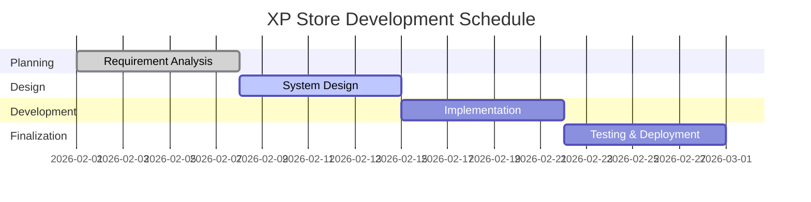
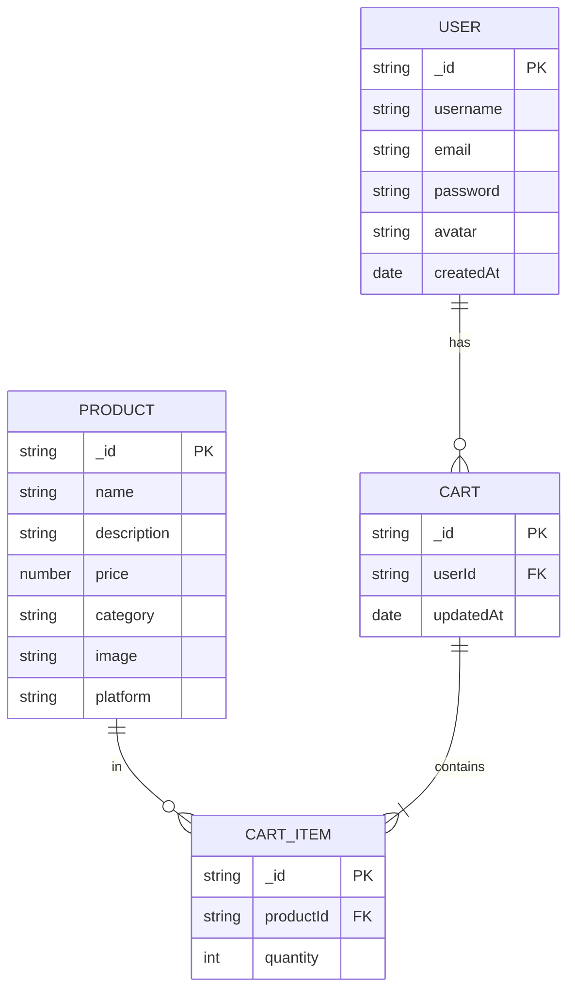
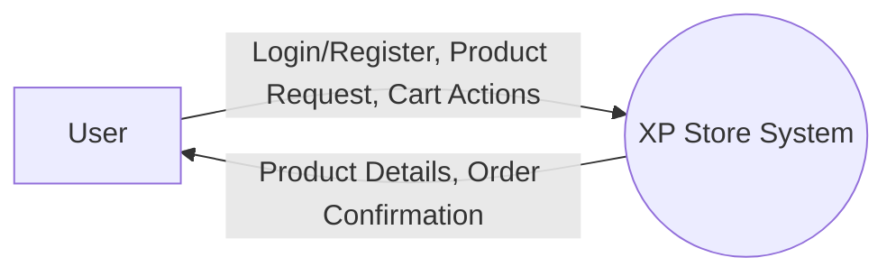
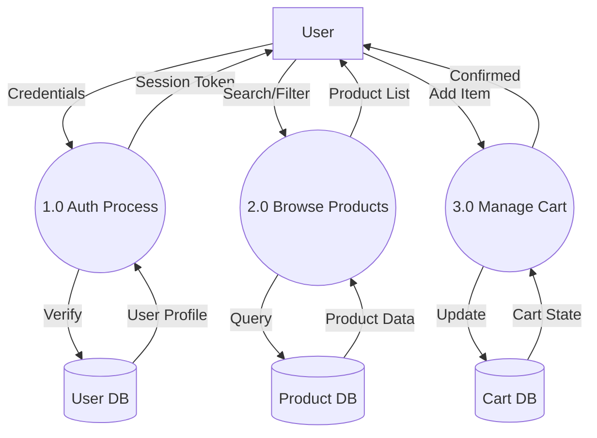
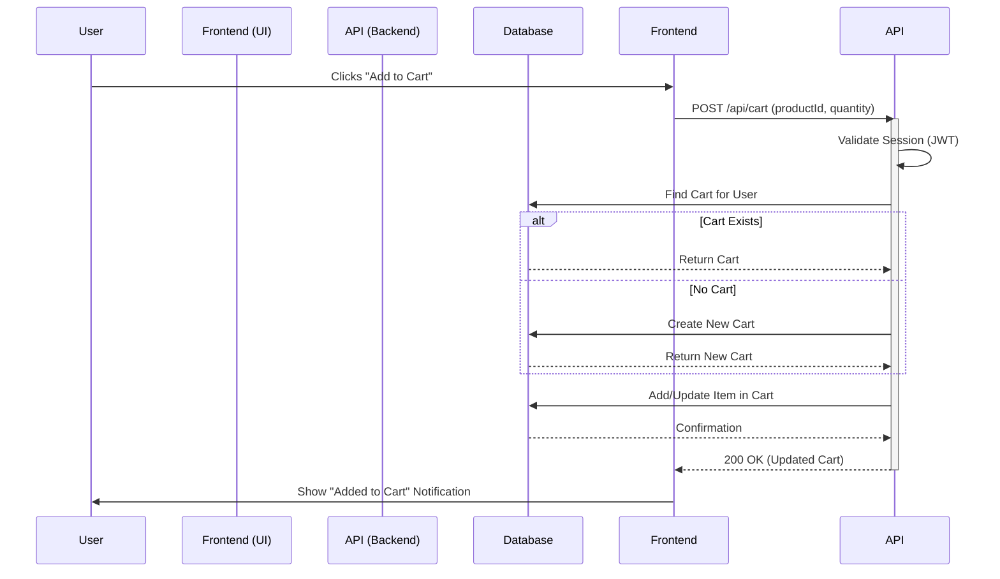

# Chapter 3 – Requirement and Analysis

## 3.1 Problem Definition
The gaming market is currently fragmented across multiple ecosystems—PlayStation, Xbox, Nintendo, and PC. Gamers often have to navigate separate storefronts with different interfaces, account systems, and payment methods to find products for their specific platforms. This fragmentation leads to a disjointed user experience, making it difficult to compare prices, discover new titles across platforms, and manage a unified wishlist or cart.

XP Store addresses this issue by providing a **centralized digital marketplace** that aggregates product listings from all major gaming platforms into a single, cohesive interface. The problem is not just about availability, but about **accessibility and user experience**. A unified platform simplifies the discovery process, streamlines the purchasing journey (in a real-world scenario), and provides a consistent UI/UX regardless of the target platform.

## 3.2 Requirement Specification

### 3.2.1 Functional Requirements
These requirements define the specific behaviors and functions of the system:
1.  **User Authentication**: Users must be able to register and log in using an email and password. The system must verify credentials and issue a secure JWT for session management.
2.  **Product Browsing & Filtering**: Users should be able to view a list of products and filter them by category (PlayStation, Xbox, Nintendo, PC).
3.  **Product Details**: Clicking on a product should display detailed information, including price, description, platform, and images.
4.  **Shopping Cart**: Users must be able to add items to a cart, view the cart, update quantities, and remove items. The cart functionality should persist or be manageable within the session.
5.  **User Profile**: Users should have a profile section to view their details and potential order history (future scope).
6.  **Responsive Design**: The application must be usable on desktops, tablets, and mobile devices.

### 3.2.2 Non-Functional Requirements
These requirements define the quality attributes of the system:
1.  **Performance**: The application should load the main page within 2 seconds on standard 4G networks. API responses should be under 200ms.
2.  **Scalability**: The architecture (Next.js + MongoDB) should support horizontal scaling to handle increased traffic.
3.  **Security**: User passwords must be hashed before storage. All data transmission must occur over HTTPS. JWTs must be signed securely.
4.  **Usability**: The UI should be intuitive, with a maximum of 3 clicks to reach any product from the homepage.
5.  **Maintainability**: The codebase should be modular, using components and clear separation of concerns (Frontend vs. Backend logic).

## 3.3 Planning and Scheduling
The project development is divided into four main phases over a 4-week period.

| Phase | Duration | Tasks |
| :--- | :--- | :--- |
| **Requirement Analysis** | Week 1 | Problem definition, requirement gathering, technology selection breakdown. |
| **System Design** | Week 2 | Database schema design, API route planning, UI wireframing/prototyping. |
| **Implementation** | Week 3 | Frontend development (Next.js components), Backend API integration, Database connectivity. |
| **Testing & Deployment** | Week 4 | Functional testing, bug fixing, documentation, and final review. |



## 3.4 Software and Hardware Requirement

### 3.4.1 Software Requirements
-   **Operating System**: Windows 10/11, macOS, or Linux.
-   **Code Editor**: Visual Studio Code (recommended) with ES7+ React/Redux snippets.
-   **Runtime Environment**: Node.js (v18 or higher).
-   **Framework**: Next.js (App Router).
-   **Database**: MongoDB (Atlas or Local).
-   **Version Control**: Git & GitHub.
-   **API Testing**: Postman or Thunder Client.
-   **Browser**: Google Chrome, Firefox, or Edge for testing.

### 3.4.2 Hardware Requirements
-   **Processor**: Intel Core i5 / AMD Ryzen 5 or better.
-   **RAM**: 8GB minimum (16GB recommended for smooth development).
-   **Storage**: 256GB SSD or higher.
-   **Internet Connection**: Broadband connection for package installation and cloud database access.

## 3.5 Conceptual Models

### 3.5.1 Entity Relationship Diagram (ER Diagram)
The ER Diagram represents the data entities and their relationships within the MongoDB database.



### 3.5.2 Data Flow Diagram

#### DFD (Level-0)
The Context Diagram (Level-0) depicts the interaction between the System and external entities.



#### DFD (Level-1)
The Level-1 DFD expands the system into its major functional processes.



### 3.5.3 Use Case Diagrams
The Use Case Diagram illustrates the interactions between the Registered User and the system.

```mermaid
usecaseDiagram
    actor "Registered User" as U

    package "XP Store System" {
        usecase "Register / Login" as UC1
        usecase "Browse Products" as UC2
        usecase "Search / Filter" as UC3
        usecase "View Product Details" as UC4
        usecase "Manage Cart (Add/Remove)" as UC5
        usecase "Manage Profile" as UC6
    }

    U --> UC1
    U --> UC2
    U --> UC3
    U --> UC4
    U --> UC5
    U --> UC6
```

### 3.5.4 Sequence Diagram
The Sequence Diagram depicts the interaction between objects in a sequential order for a specific scenario, such as "Add to Cart".

**Scenario: User Adds a Product to Cart**


